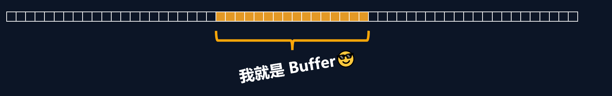

# 一、概念

Buffer 中文译为缓冲区，是一个类似于数组的 对象 ，用于表示固定长度的字节序列

Buffer 本质是一段内存空间，专门用来处理 二进制数据 。



# 二、特点

1.  Buffer 大小固定且无法调整

2.  Buffer 性能较好，可以直接对计算机内存进行操作

3.  Buffer 中每个元素的大小为 1 字节（byte）


# 三、使用

## 1. 创建 Buffer

Node.js 中创建 Buffer 的方式主要如下几种：

1. Buffer.alloc

   ```js
   //创建了一个长度为 10 字节的 Buffer，相当于申请了 10 字节的内存空间，每个字节的值为 0
   let buf_1 = Buffer.alloc(10); 
   // 结果为 <Buffer 00 00 00 00 00 00 00 00 00 00>
   ```

2. Buffer.allocUnsafe

   ```js
   //创建了一个长度为 10 字节的 Buffer，buffer 中可能存在旧的数据, 可能会影响执行结果，所以叫unsafe
   //但这种方式比alloc创建Buffer快一些
   let buf_2 = Buffer.allocUnsafe(10);
   ```

3. Buffer.from

   ```js
   //通过字符串创建 Buffer
   //每个字符都会转换为其在Unicode表中对应的十进制，然后存入Buffer
   let buf_3 = Buffer.from('hello');
   console.log(buf_3);//<Buffer 68 65 6c 6c 6f>
   //通过数组创建 Buffer
   let buf_4 = Buffer.from([105, 108, 111, 118, 101, 121, 111, 117]);
   console.log(buf_4);//<Buffer 69 6c 6f 76 65 79 6f 75>
   ```

## 2.Buffer 与字符串的转化

我们可以借助 toString 方法将 Buffer 转为字符串

```js
//buffer与字符串的转换
let buf_4 = Buffer.from([105, 108, 111, 118, 101, 121, 111, 117]);
console.log(buf_4.toString());//iloveyou
```

> toString 默认是按照 utf-8 编码方式进行转换的。

## 3.Buffer 的读写

Buffer 可以直接通过 \[ \] 的方式对数据进行处理。

```js
//读取
let buf=Buffer.from('hello');
console.log(buf);//<Buffer 68 65 6c 6c 6f>
console.log(buf.toString());//hello
console.log(buf[0]);//104
console.log(buf[0].toString(2));//1101000

//修改
buf[0]=95;
console.log(buf);//<Buffer 5f 65 6c 6c 6f>

//查看字符串结果
console.log(buf.toString());//_ello
```

> 注意: 
>
> 1. 如果修改的数值超过 255 ，则超过 8 位数据会被舍弃 
> 2. 一个 utf-8 的中文字符 一般 占 3 个字节

```js
//溢出
let buf1=Buffer.from('hello');
console.log(buf1);//<Buffer 68 65 6c 6c 6f>
buf1[0]=361;//舍弃高位的数字
console.log(buf1)//<Buffer 69 65 6c 6c 6f>

//中文
let buf2=Buffer.from('你好');
console.log(buf2);//<Buffer e4 bd a0 e5 a5 bd>
```

