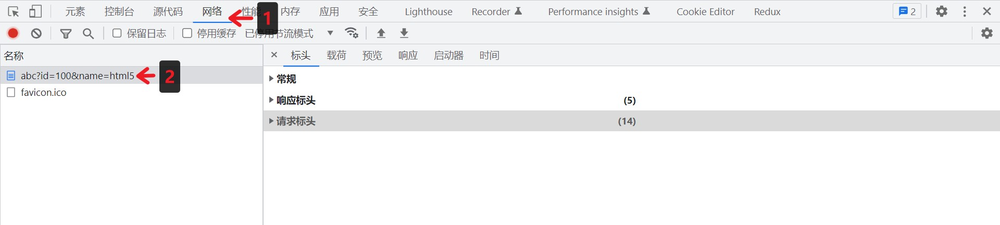
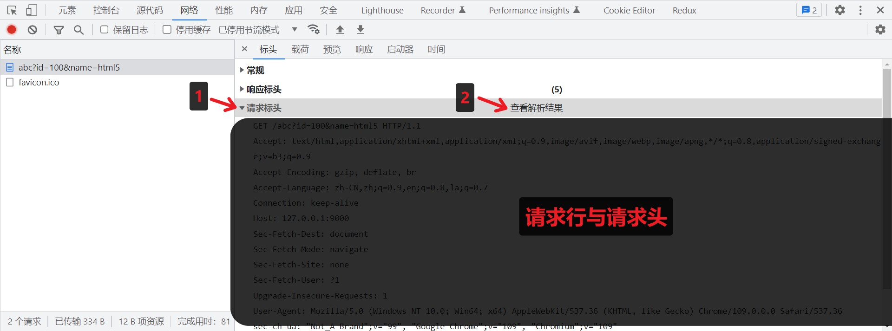
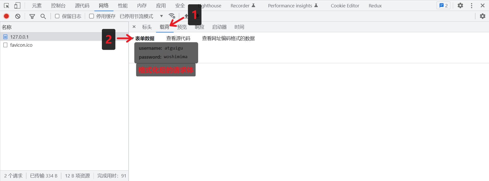
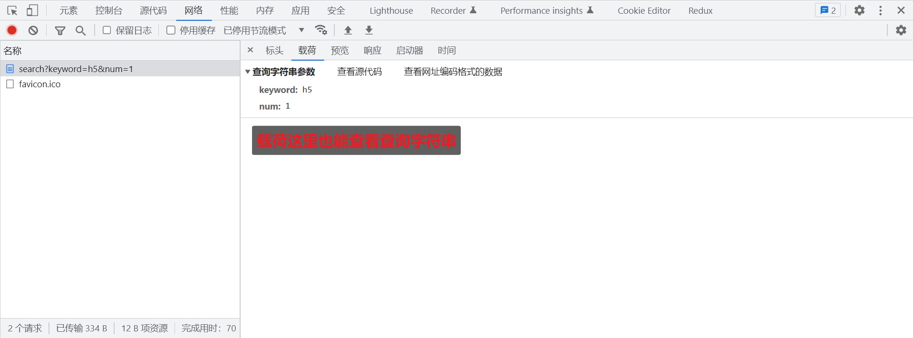
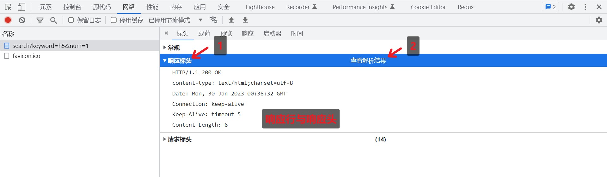
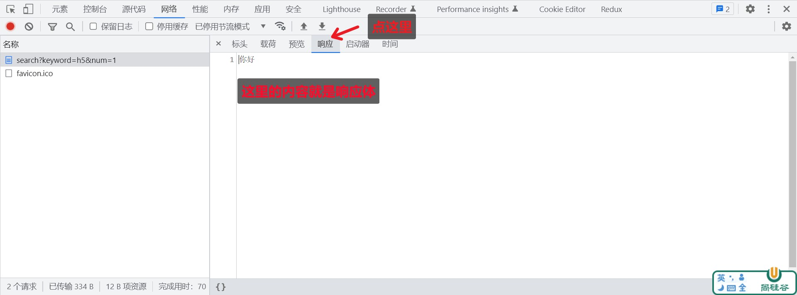
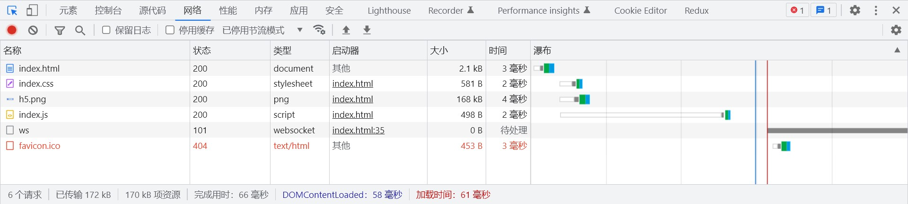

# 一、概念

HTTP（hypertext transport protocol）协议；中文叫**超文本传输协议**

是一种基于TCP/IP的应用层通信协议

这个协议详细规定了 浏览器 和万维网 服务器之间互相通信的规则。协议中主要规定了两个方面的内容

* 客户端：用来向服务器发送数据，可以被称之为**请求报文**

* 服务端：向客户端返回数据，可以被称之为**响应报文**

> 报文：可以简单理解为就是一堆字符串

# 二、请求报文的组成

1. 请求行
2. 请求头
3. 空行
4. 请求体

```http
GET https://www.baidu.com/ HTTP/1.1
Accept: text/html,application/xhtml+xml,application/xml;q=0.9,image/webp,image/apng,*/*;q=0.8,application/signed-exchange;v=b3;q=0.7
Accept-Encoding: gzip, deflate, br
Accept-Language: zh-CN,zh;q=0.9,en;q=0.8,en-GB;q=0.7,en-US;q=0.6
Cache-Control: max-age=0
Connection: keep-alive
Cookie: BAIDUID=75475BF430B1C80D21864B55150B3C4D:FG=1; BAIDUID_BFESS=75475BF430B1C80D21864B55150B3C4D:FG=1; __bid_n=1871392f7f44608f6eb3cc; BDUSS=Ux0MDd1VmVRdE5pdX41NVpXcGMwc1NtVVRxNzdxYktsNFByRTdJZ2JFckJOVVZrSVFBQUFBJCQAAAAAAQAAAAEAAADUFGFDAAAAAAAAAAAAAAAAAAAAAAAAAAAAAAAAAAAAAAAAAAAAAAAAAAAAAAAAAAAAAAAAAAAAAAAAAAAAAAAAAAAAAMGoHWTBqB1kb; BDUSS_BFESS=Ux0MDd1VmVRdE5pdX41NVpXcGMwc1NtVVRxNzdxYktsNFByRTdJZ2JFckJOVVZrSVFBQUFBJCQAAAAAAQAAAAEAAADUFGFDAAAAAAAAAAAAAAAAAAAAAAAAAAAAAAAAAAAAAAAAAAAAAAAAAAAAAAAAAAAAAAAAAAAAAAAAAAAAAAAAAAAAAMGoHWTBqB1kb; BIDUPSID=75475BF430B1C80D21864B55150B3C4D; PSTM=1680247958; ZFY=WFMYIv0:BHJwLbm64Qs135HK99qT977A6ntvpfYyoraU:C; BD_HOME=1; H_PS_PSSID=38515_36545_38470_38185_38368_38468_38379_36805_37930_38504_26350; BD_UPN=12314753; BA_HECTOR=0la08ha420a4a080al8g8g8n1i3esmu1m
Host: www.baidu.com
Sec-Fetch-Dest: document
Sec-Fetch-Mode: navigate
Sec-Fetch-Site: none
Sec-Fetch-User: ?1
Upgrade-Insecure-Requests: 1
User-Agent: Mozilla/5.0 (Windows NT 10.0; Win64; x64) AppleWebKit/537.36 (KHTML, like Gecko) Chrome/112.0.0.0 Safari/537.36 Edg/112.0.1722.39
sec-ch-ua: "Chromium";v="112", "Microsoft Edge";v="112", "Not:A-Brand";v="99"
sec-ch-ua-mobile: ?0
sec-ch-ua-platform: "Windows"
```

# 三、HTTP 的请求行

1. 请求方法（get、post、put、delete等）

| 方法       | 作用             |
| ---------- | ---------------- |
| GET        | 主要用于获取数据 |
| POST       | 主要用于新增数据 |
| PUT／PATCH | 主要用于更新数据 |
| DELETE     | 主要用于删除数据 |

2. 请求 URL

URL：Uniform  Resource  Locator  统一资源定位符，其本身也是一个字符串

例如：[**http://www.baidu.com:80/index.html?a=100&b=200#logo**](http://www.baidu.com/index.html?a=100&b=200&logo)，其组成部分为：

* http： 协议名（https、ftp、ssh等）

* [www.baidu.com](http://www.baidu.com/)：主机名，可以是域名也可是 IP 地址

* 80：端口号

* /index.html：路径
* a=100&b=200：查询字符串
* #logo：哈希（锚点链接）

3. HTTP协议版本号

| 版本号 | 发布时间 |
| ------ | -------- |
| 1.0    | 1996年   |
| 1.1    | 1999年   |
| 2      | 2015年   |
| 3      | 2018年   |

# 四、HTTP 请求头

> 格式：『头名：头值』

常见的请求头有：

| 请求头                    | 解释                                                         |
| ------------------------- | ------------------------------------------------------------ |
| Host                      | 主机名                                                       |
| Connection                | 连接的设置：keep-alive（保持连接）、close（关闭连接）        |
| Cache-Control             | 缓存控制 max-age = 0 （没有缓存）                            |
| Upgrade-Insecure-Requests | 将网页中的http请求转化为https请求（很少用）老网站升级        |
| User-Agent                | 用户代理，客户端字符串标识，服务器可以通过这个标识来识别这个请求来自哪个客户端，一般在PC端和手机端的区分 |
| Accept                    | 设置浏览器接收的数据类型                                     |
| Accept-Encoding           | 设置接收的压缩方式                                           |
| Accept- Language          | 设置接收的语言 q=0.7 为喜好系数，满分为1                     |
| Cookie                    | 后面单独讲                                                   |

请求头参考网址：https://developer.mozilla.org/zh-CN/docs/Web/HTTP/Headers

# 五、HTTP 的请求体

请求体内容的格式是非常灵活的，可以设置任意内容

（可以是空）==\> GET请求，

（也可以是字符串，还可以是JSON）===\> POST请求

例如：

* 字符串：keywords=手机&price=2000
* JSON：{\"keywords\":\"手机\",\"price\":2000}

# 六、响应报文的组成

1. 响应行

举例：HTTP/1.1 200 OK，，其组成部分为：

* HTTP/1.1：HTTP协议版本号

* 200：响应状态码

| 状态码 | 含义           |
| ------ | -------------- |
| 200    | 请求成功       |
| 403    | 禁止请求       |
| 404    | 找不到资源     |
| 500    | 服务器内部错误 |

还有一些状态码，参考：[https://developer.mozilla.org/zh-CN/docs/Web/HTTP/Status](https://developer.mozilla.org/zh-CN/docs/Web/HTTP/Status)

HTTP协议对状态码进行了分类：

| 状态码 | 含义           |
| ------ | -------------- |
| 1xx    | 信息响应       |
| 2xx    | 成功响应       |
| 3xx    | 重定向消息     |
| 4xx    | 客户端错误响应 |
| 5xx    | 服务端错误响应 |

* OK：响应状态描述

| 状态码 | 状态描述              |
| ------ | --------------------- |
| 200    | OK                    |
| 403    | Forbidden             |
| 404    | Not Found             |
| 500    | Internal Server Error |

> 响应状态码和响应字符串关系是一一对应的。

2. 响应头

```
Cache-Control:缓存控制 private 私有的，只允许客户端缓存数据
Connection 链接设置
Content-Type:text/html;charset=utf-8 设置响应体的数据类型以及字符集,响应体为html，字符集utf-8
Content-Length:响应体的长度，单位为字节
```

3. 空行
4. 响应体

响应体内容的类型是非常灵活的，常见的类型有 HTML、CSS、JS、图片、视频、JSON

```http
HTTP/1.1 200 OK
Bdpagetype: 2
Bdqid: 0xd8d096d600092e47
Cache-Control: private
Connection: keep-alive
Content-Encoding: gzip
Content-Security-Policy: frame-ancestors 'self' https://chat.baidu.com https://fj-chat.baidu.com https://hba-chat.baidu.com https://hbe-chat.baidu.com https://njjs-chat.baidu.com https://nj-chat.baidu.com https://hna-chat.baidu.com https://hnb-chat.baidu.com;
Content-Type: text/html;charset=utf-8
Date: Thu, 13 Apr 2023 07:21:39 GMT
Expires: Thu, 13 Apr 2023 07:21:39 GMT
Isprivate: 1
Server: BWS/1.1
Set-Cookie: BDSVRTM=387; path=/
Set-Cookie: BD_HOME=1; path=/
Set-Cookie: H_PS_PSSID=38515_36545_38470_38368_38468_38379_36805_37930_38504_26350_38186; path=/; domain=.baidu.com
Strict-Transport-Security: max-age=172800
Traceid: 1681370499023677415415623152953216020039
X-Ua-Compatible: IE=Edge,chrome=1
Transfer-Encoding: chunked

<!DOCTYPE html><!--STATUS OK-->
<html>
	<head>
		<meta http-equiv="Content-Type" content="text/html;charset=utf-8">
		<meta name="description" content="全球领先的中文搜索引擎、致力于让网民更便捷地获取信息">
		<link rel="shortcut icon" href="/favicon.ico" type="image/x-icon" />
		<title>百度一下，你就知道</title>
		<style type="text/css" index="head">
			h1,h2,h3,h4,h5,h6{font-size:100%}
		</style>
	</head>
	<body>
		<form action="/s">
			<input type="text" class="s_ipt" name="wd"><input type="submit" value="百度一下"/>
		</form>
	</body>
</html>
```

# 七、创建 HTTP 服务

使用 nodejs 创建 HTTP 服务

## 操作步骤

```js
//1. 导入 http 模块
const http = require('http');

//2. 创建服务对象
// request 意为请求. 是对请求报文的封装对象, 通过 request 对象可以获得请求报文的数据
// response 意为响应. 是对响应报文的封装对象, 通过 response 对象可以设置响应报文
//当服务端接收到HTTP请求时执行回调函数
const server = http.createServer((request, response) => {
  // response.end('Hello HTTP'); //设置响应体
  response.setHeader('content-type', 'text/html;charset=utf-8');
  response.end('你好'); //设置响应体
});

//3. 监听端口, 启动服务
//当服务启动成功后执行回调函数
server.listen(9000, () => {
  console.log('服务已经启动....')
});
```

> http.createServer 里的回调函数的执行时机： 当接收到 HTTP 请求的时候，就会执行

## 测试

浏览器请求对应端口

```http
http://127.0.0.1:9000
```

## 注意事项

1.  命令行 ctrl + c 停止服务

2.  当服务启动后，更新代码必须重启服务才能生效

3.  响应内容中文乱码的解决办法

`response.setHeader('content-type','text/html;charset=utf-8');`

4. 端口号被占用

   `Error: listen EADDRINUSE: address already in use :::9000`

   1. 关闭当前正在运行监听端口的服务 （ 使用较多 ）
   2. 修改其他端口号

5. HTTP 协议默认端口是 80 。HTTPS 协议的默认端口是 443,，HTTP 服务开发常用端口有 3000， 8080，8090，9000 等

> 如果端口被其他程序占用，可以使用 资源监视器 找到占用端口的程序，然后使用 任务管理器 关闭 对应的程序

# 八、浏览器查看 HTTP 报文

点击步骤



## 1、查看请求行与请求头



## 2、查看请求体



## 3、查看 URL 查询字符串



## 4、查看响应行与响应头



## 5、查看响应体



# 九、获取 HTTP 请求报文

## 1、基本方法

想要获取请求的数据，需要通过 request 对象


| 含义           | 语法                                                         | 重点掌握 |
| -------------- | ------------------------------------------------------------ | -------- |
| 请求方法       | request.method                                               | *        |
| 请求版本       | request.httpVersion                                          |          |
| 请求路径       | request.url                                                  | *        |
| URL 路径       | require(\'url\').parse(request.url).pathname                 | *        |
| URL 查询字符串 | require(\'url\').parse(request.url,true).query               | *        |
| 请求头         | request.headers                                              | *        |
| 请求体         | request.on(\'data\',function(chunk){})<br/>request.on(\'end\', function(){}); |          |

注意事项：

1.  request.url 只能获取路径以及查询字符串，无法获取 URL 中的域名以及协议的内容
2.  request.headers 将请求信息转化成一个对象，并将属性名都转化成了『小写』

3. 关于路径：如果访问网站的时候，只填写了 IP 地址或者是域名信息，此时请求的路径为『 / 』

4. 关于 favicon.ico：这个请求是属于浏览器自动发送的请求

```js
//1. 导入 http 模块
const http = require('http');

//2. 创建服务对象
const server = http.createServer((request, response) => {
  //获取请求的方法
  console.log(request.method);
  //获取请求的 url
  console.log(request.url);// 只包含 url 中的路径与查询字符串
  //获取 HTTP 协议的版本号
  console.log(request.httpVersion);
  //获取 HTTP 的请求头
  //console.log(request.headers); 
  console.log(request.headers.host);
  response.end('http'); //设置响应体
});

//3. 监听端口, 启动服务
server.listen(9000, () => {
  console.log('服务已经启动....')
});
```

获取请求体代码示例：

```js
//1. 导入 http 模块
const http = require('http');

//2. 创建服务对象
const server = http.createServer((request, response) => {
  //1. 声明一个变量
  let body = '';
  //2. 绑定 data 事件
  request.on('data', chunk => {
    body += chunk;
  })
  //3. 绑定 end 事件
  request.on('end', () => {
    console.log(body);
    //响应
    response.end('Hello HTTP');
  });
});

//3. 监听端口, 启动服务
server.listen(9000, () => {
  console.log('服务已经启动....')
});
```

获取 url 和查询字符串的方式一代码示例：

```js
//导入 http 模块
const http = require('http');
//1. 导入 url 模块
const url = require('url');

//创建服务对象
const server = http.createServer((request, response) => {
  //2. 解析 request.url 
  // console.log(request.url);
  let res = url.parse(request.url, true);//第二个参数设置为true，则res对象的query属性会变成一个对象而不是字符串
  console.log(res);
  //路径
  let pathname = res.pathname;
  console.log(pathname);
  //查询字符串
  let keyword = res.query.keyword;
  console.log(keyword);

  response.end('url');
});

//监听端口, 启动服务
server.listen(9000, () => {
  console.log('服务已经启动....')
});
```

获取 url 和查询字符串的方式二代码示例：

```js
//导入 http 模块
const http = require('http');

//创建服务对象
const server = http.createServer((request, response) => {
  //实例化 URL 的对象
  // let url = new URL('http://127.0.0.1:9000/search?a=100&b=200');
  // let url = new URL('/search?a=100&b=200', 'http://127.0.0.1:9000');
  let url = new URL(request.url, 'http://127.0.0.1');
  //输出路径
  console.log(url.pathname);
  //输出 keyword 查询字符串
  console.log(url.searchParams.get('keyword'));
  response.end('url new');
});

//监听端口, 启动服务
server.listen(9000, () => {
  console.log('服务已经启动....')
});
```

## 2、练习

按照以下要求搭建 HTTP 服务

| 请求类型(方法) | 请求地址 | 响应体结果 |
| -------------- | -------- | ---------- |
| get            | /login   | 登录页面   |
| get            | /reg     | 注册页面   |

```js
//1、引入http模块
const http = require("http");
//2、建立服务
const server = http.createServer((request,response)=>{
    //获取请求的方法
    //对象的解构赋值
    let {method} = request;
    //获取请求的 url 路径
    let {pathname} = new URL(request.url, 'http://127.0.0.1');
    //设置响应头信息，解决中文乱码
    response.setHeader("Content-Type","text/html;charset=utf-8")
    
    //判断
    if(method === 'GET' && pathname === '/login'){
        //登录的情形
        response.end('登录页面');
    }else if(method === 'GET' && pathname === '/reg'){ // register 注册
        response.end('注册页面');
    }else{
        response.end('Not Found');
    }
})

//3. 监听端口 启动服务
server.listen(9000, () => {
  console.log('服务已经启动.. 端口 9000 监听中....');
})
```

# 十、设置 HTTP 响应报文

## 1、基本方法

| 作用             | 语法                                             |
| ---------------- | ------------------------------------------------ |
| 设置响应状态码   | response.statusCode                              |
| 设置响应状态描述 | response.statusMessage （ 用的非常少 ）          |
| 设置响应头信息   | response.setHeader(\'头名\', \'头值\')           |
| 设置响应体       | response.write(\'xx\')<br/>response.end(\'xxx\') |

```js
write 和 end 的两种使用情况：
//1. write 和 end 的结合使用 响应体相对分散
response.write('xx');
response.write('xx');
response.write('xx');
response.end(); //每一个请求，在处理的时候必须要执行 end 方法的
//2. 单独使用 end 方法 响应体相对集中
response.end('xxx');
```

代码示例：

```js
//导入 http 模块
const http = require('http');

//创建服务对象
const server = http.createServer((request, response) => {
  //1. 设置响应状态码
  response.statusCode = 203;
  response.statusCode = 404;
  //2. 响应状态的描述 
  response.statusMessage = 'iloveyou';
  //3. 响应头的设置
  response.setHeader('content-type', 'text/html;charset=utf-8');
  response.setHeader('Server', 'Node.js');
  response.setHeader('myHeader', 'test test test');//自定义响应头
  response.setHeader('test', ['a','b','c']);//设置多个同名响应头
  //4. 响应体的设置
  response.write('I');
  response.write('love');
  response.write('you');
  response.write('forever');
  response.end('love'); //一般用write设置后end中不再设置内容
  //response.end('xxx'); //回调函数中必须设置end方法且只能设置一个
});

//监听端口, 启动服务
server.listen(9000, () => {
  console.log('服务已经启动....')
});
```

## 2、练习

搭建 HTTP 服务，响应一个 4 行 3 列的表格，并且要求表格有隔行换色效果，且点击单元格能高亮显示

```js
//导入 http 模块
const http = require('http');
//创建服务对象
const server = http.createServer((request, response) => {
    response.end(`
        <!DOCTYPE html>
        <html lang="en">
        <head>
            <meta charset="UTF-8">
            <meta http-equiv="X-UA-Compatible" content="IE=edge">
            <meta name="viewport" content="width=device-width, initial-scale=1.0">
            <title>Document</title>
            <style>
                td{
                	padding: 20px 40px;
                }
                table tr:nth-child(odd){
                	background: #aef;
                }
                table tr:nth-child(even){
                	background: #fcb;
                }
                table, td{
                	border-collapse: collapse;
                }
            </style>
        </head>
        <body>
            <table border="1">
                <tr><td></td><td></td><td></td></tr>
                <tr><td></td><td></td><td></td></tr>
                <tr><td></td><td></td><td></td></tr>
                <tr><td></td><td></td><td></td></tr>
            </table>
            <script>
                //获取所有的 td
                let tds = document.querySelectorAll('td');
                //遍历
                tds.forEach(item => {
                    item.onclick = function(){
                    	this.style.background = '#222';
                    }
                })
            </script>
        </body>
        </html>
    `); //设置响应体
});

//监听端口, 启动服务
server.listen(9000, () => {
	console.log('服务已经启动....')
});
```

对其进行优化：将 html 内容放入一个单独的文件，响应时读取这个文件即可

```js
//导入 http 模块
const http = require('http');
const fs = require('fs');

//创建服务对象
const server = http.createServer((request, response) => {
  //读取文件内容
  let html = fs.readFileSync(__dirname + '/10_table.html');
  
  response.end(html); //设置响应体
});

//监听端口, 启动服务
server.listen(9000, () => {
  console.log('服务已经启动....')
});
```

新建一个 table.html 文件：

```html
<!DOCTYPE html>
<html lang="en">

<head>
  <meta charset="UTF-8">
  <meta http-equiv="X-UA-Compatible" content="IE=edge">
  <meta name="viewport" content="width=device-width, initial-scale=1.0">
  <title>Document</title>
  <style>
    td {
      padding: 20px 40px;
    }

    table tr:nth-child(odd) {
      background: rgb(179, 165, 201);
    }

    table tr:nth-child(even) {
      background: #fcb;
    }

    table,
    td {
      border-collapse: collapse;
    }
  </style>
</head>

<body>
  <table border="1">
    <tr>
      <td></td>
      <td></td>
      <td></td>
    </tr>
    <tr>
      <td></td>
      <td></td>
      <td></td>
    </tr>
    <tr>
      <td></td>
      <td></td>
      <td></td>
    </tr>
    <tr>
      <td></td>
      <td></td>
      <td></td>
    </tr>
  </table>
  <script>
    //获取所有的 td
    let tds = document.querySelectorAll('td');
    //遍历
    tds.forEach(item => {
      item.onclick = function () {
        this.style.background = '#222';
      }
    })
  </script>
</body>

</html>
```

# 十一、网页资源的基本加载过程




网页资源的加载都是循序渐进的，首先获取 HTML 的内容， 然后解析 HTML。再发送其他资源的请求，

如 CSS，Javascript，图片等。理解了这个内容对于后续的学习与成长有非常大的帮助。

练习：搭建 HTTP 服务，响应一个 4 行 3 列的表格，并且要求表格有隔行换色效果，且点击单元格能高亮显示。要求以引入外部 html、css、js 资源的方式实现

```js
//导入 http 模块
const http = require('http');
const fs = require('fs');

//创建服务对象
const server = http.createServer((request, response) => {
  //获取请求url的路径
  let {pathname} = new URL(request.url, 'http://127.0.0.1');
  if(pathname === '/'){
    //读取文件内容
    let html = fs.readFileSync(__dirname + '/10_table.html');
    response.end(html); //设置响应体
  }else if(pathname === '/index.css'){
    //读取文件内容
    let css = fs.readFileSync(__dirname + '/index.css');
    response.end(css); //设置响应体
  }else if(pathname === '/index.js'){
    //读取文件内容
    let js = fs.readFileSync(__dirname + '/index.js');
    response.end(js); //设置响应体
  }else{
    response.statusCode = 404;
    response.end('<h1>404 Not Found</h1>')
  }
});

//监听端口, 启动服务
server.listen(9000, () => {
  console.log('服务已经启动....')
});
```

新建一个 table.html 文件：

```html
<!DOCTYPE html>
<html lang="en">

<head>
  <meta charset="UTF-8">
  <meta http-equiv="X-UA-Compatible" content="IE=edge">
  <meta name="viewport" content="width=device-width, initial-scale=1.0">
  <title>Document</title>
  <link rel="stylesheet" href="./index.css">
</head>

<body>
  <table border="1">
    <tr>
      <td></td>
      <td></td>
      <td></td>
    </tr>
    <tr>
      <td></td>
      <td></td>
      <td></td>
    </tr>
    <tr>
      <td></td>
      <td></td>
      <td></td>
    </tr>
    <tr>
      <td></td>
      <td></td>
      <td></td>
    </tr>
  </table>
  <script src="./index.js"></script>
</body>

</html>
```

新建一个 index.css 文件：

```css
td {
  padding: 20px 40px;
}

table tr:nth-child(odd) {
  background: rgb(179, 165, 201);
}

table tr:nth-child(even) {
  background: #fcb;
}

table,
td {
  border-collapse: collapse;
}
```

新建一个 index.js 文件：

```js
//获取所有的 td
let tds = document.querySelectorAll('td');
//遍历
tds.forEach(item => {
  item.onclick = function () {
    this.style.background = '#222';
  }
})
```

# 十二、静态资源服务

静态资源是指 内容长时间不发生改变的资源 ，例如图片，视频，CSS 文件，JS文件，HTML文件，字体文件等

动态资源是指 内容经常更新的资源，例如百度首页，网易首页，京东搜索列表页面等

搭建静态资源服务：

```js
/**
 * 创建一个 HTTP 服务，端口为 9000，满足如下需求
 * GET  /index.html        响应  page/index.html 的文件内容
 * GET  /css/app.css       响应  page/css/app.css 的文件内容
 * GET  /images/logo.png   响应  page/images/logo.png 的文件内容
 */
//导入 http 模块
const http = require('http');
const fs = require('fs');
const path = require('path');

//创建服务对象
const server = http.createServer((request, response) => {
  //获取请求url的路径
  let {pathname} = new URL(request.url, 'http://127.0.0.1');
  //拼接文件路径
  let filePath = __dirname + '/page' + pathname;
  //读取文件 fs 异步 API
  fs.readFile(filePath, (err, data) => {
    if(err){
        response.setHeader('content-type','text/html;charset=utf-8');
    	response.statusCode = 500;
    	response.end('文件读取失败~~');
        return;
    }
    
    //响应文件内容
    response.end(data);
  })
});

//监听端口, 启动服务
server.listen(9000, () => {
  console.log('服务已经启动....')
});
```

## 1、网站根目录或静态资源目录

HTTP 服务在哪个文件夹中寻找静态资源，那个文件夹就是 静态资源目录，也称之为网站根目录

> 思考：vscode 中使用 live-server 访问 HTML 时， 它启动的服务中网站根目录是谁？
>
> 以打开的文件夹作为根目录

## 2、网页中的 URL

网页中的 URL 主要分为两大类：相对路径与绝对路径

### 绝对路径

绝对路径可靠性强，而且相对容易理解，在项目中运用较多

| 形式                   | 特点                                                         |
| ---------------------- | ------------------------------------------------------------ |
| http://atguigu.com/web | 直接向目标资源发送请求，容易理解。网站的外链会用到此形式     |
| //atguigu.com/web      | 与页面 URL 的协议拼接形成完整 URL 再发送请求。大型网站用的比较多 |
| /web                   | 与页面 URL 的协议、主机名、端口拼接形成完整 URL 再发送请求。中小型网站 |

### 相对路径

相对路径在发送请求时，需要与当前页面 URL 路径进行 计算 ，得到完整 URL 后，再发送请求，学习阶段用的较多

例如当前网页 url 为[http://www.atguigu.com/course/h5.html](http://www.atguigu.com/course/h5.html)


| 形式               | 最终的 URL                                |
| ------------------ | ----------------------------------------- |
| ./css/app.css      | http://www.atguigu.com/course/css/app.css |
| js/app.js          | http://www.atguigu.com/course/js/app.js   |
| ../img/logo.png    | http://www.atguigu.com/img/logo.png       |
| ../../mp4/show.mp4 | http://www.atguigu.com/mp4/show.mp4       |

```html
<!DOCTYPE html>
<html lang="en">
<head>
  <meta charset="UTF-8">
  <meta http-equiv="X-UA-Compatible" content="IE=edge">
  <meta name="viewport" content="width=device-width, initial-scale=1.0">
  <title>URL</title>
</head>
<body>
  <!-- 绝对路径 -->
  <a href="https://www.baidu.com">百度</a>
  <a href="//jd.com">京东</a>
  <a href="/search">搜索</a>
  <hr>
  <!-- 相对路径 -->
  <a href="./css/app.css">访问CSS</a>
  <a href="js/app.js">访问JS</a>
  <a href="../img/logo.png">访问图片</a>
  <a href="../../img/logo.png">访问图片</a>
</body>
</html>
```

### 网页中使用 URL 的场景小结

包括但不限于如下场景：

* a 标签 href
* link 标签 href
* script 标签 src
* img 标签 src

* video audio 标签 src
* form 中的 action
* AJAX 请求中的 URL

```html
<!DOCTYPE html>
<html lang="en">
<head>
	<meta charset="UTF-8">
	<title>尚硅谷</title>
	<!-- <link rel="stylesheet" href="./css/app.css"> -->
	<link rel="stylesheet" href="/css/app.css">
	<!-- <link rel="stylesheet" href="http://127.0.0.1:9000/css/app.css"> -->
</head>
<body>
	<h1>尚硅谷前端</h1>
</body>
</html>
```

## 3、设置资源类型（mime类型）

媒体类型（通常称为 Multipurpose Internet Mail Extensions 或 MIME 类型）是一种标准，用来表示文档、文件或字节流的性质和格式。

```
mime 类型结构： [type]/[subType]
例如： text/html text/css image/jpeg image/png application/json
```

HTTP 服务可以设置响应头 Content-Type 来表明响应体的 MIME 类型，浏览器会根据该类型决定如何处理资源

下面是常见文件对应的 mime 类型：

```
html: 'text/html',
css: 'text/css',
js: 'text/javascript',
png: 'image/png',
jpg: 'image/jpeg',
gif: 'image/gif',
mp4: 'video/mp4',
mp3: 'audio/mpeg',
json: 'application/json'
```

> 对于未知的资源类型，可以选择 application/octet-stream 类型，浏览器在遇到该类型的响应 时，会对响应体内容进行独立存储，也就是我们常见的 下载 效果

对搭建静态资源服务的代码进行设置mime类型的完善，并解决中文乱码问题：

```js
/**
 * 创建一个 HTTP 服务，端口为 9000，满足如下需求
 * GET  /index.html        响应  page/index.html 的文件内容
 * GET  /css/app.css       响应  page/css/app.css 的文件内容
 * GET  /images/logo.png   响应  page/images/logo.png 的文件内容
 */
//导入 http 模块
const http = require('http');
const fs = require('fs');
const path = require('path');
//声明一个变量
let mimes = {
  html: 'text/html',
  css: 'text/css',
  js: 'text/javascript',
  png: 'image/png',
  jpg: 'image/jpeg',
  gif: 'image/gif',
  mp4: 'video/mp4',
  mp3: 'audio/mpeg',
  json: 'application/json'
}

//创建服务对象
const server = http.createServer((request, response) => {
  //获取请求url的路径
  let {pathname} = new URL(request.url, 'http://127.0.0.1');
  //声明一个变量
  let root = __dirname + '/page';
  // let root = __dirname + '/../';
  //拼接文件路径
  let filePath = root + pathname;
  //读取文件 fs 异步 API
  fs.readFile(filePath, (err, data) => {
    if(err){
        response.setHeader('content-type','text/html;charset=utf-8');
    	response.statusCode = 500;
    	response.end('文件读取失败~~');
        return;
    }
    //获取文件的后缀名
    let ext = path.extname(filePath).slice(1);
    //获取对应的类型
    let type = mimes[ext];
    if(type){
      //匹配到了                          text/html;charset=utf-8
      if(ext === 'html'){
        response.setHeader('content-type', type + ';charset=utf-8');
      }else{
        response.setHeader('content-type', type);
      }
    }else{
      //没有匹配到
      response.setHeader('content-type', 'application/octet-stream');
    }
    //响应文件内容
    response.end(data);
  })
  
});

//监听端口, 启动服务
server.listen(9000, () => {
  console.log('服务已经启动....')
});
```

再完善错误处理：

```js
/**
 * 创建一个 HTTP 服务，端口为 9000，满足如下需求
 * GET  /index.html        响应  page/index.html 的文件内容
 * GET  /css/app.css       响应  page/css/app.css 的文件内容
 * GET  /images/logo.png   响应  page/images/logo.png 的文件内容
 */
//导入 http 模块
const http = require('http');
const fs = require('fs');
const path = require('path');
//声明一个变量
let mimes = {
  html: 'text/html',
  css: 'text/css',
  js: 'text/javascript',
  png: 'image/png',
  jpg: 'image/jpeg',
  gif: 'image/gif',
  mp4: 'video/mp4',
  mp3: 'audio/mpeg',
  json: 'application/json'
}

//创建服务对象
const server = http.createServer((request, response) => {
  if(request.method !== 'GET'){
    response.statusCode = 405;
    response.end('<h1>405 Method Not Allowed</h1>');
    return;
  }
  //获取请求url的路径
  let {pathname} = new URL(request.url, 'http://127.0.0.1');
  //声明一个变量
  let root = __dirname + '/page';
  // let root = __dirname + '/../';
  //拼接文件路径
  let filePath = root + pathname;
  //读取文件 fs 异步 API
  fs.readFile(filePath, (err, data) => {
    if(err){
      console.log(err);
      //设置字符集
      response.setHeader('content-type','text/html;charset=utf-8');
      //判断错误的代号
      switch(err.code){
        case 'ENOENT':
          response.statusCode = 404;
          response.end('<h1>404 Not Found</h1>');
        case 'EPERM':
          response.statusCode = 403;
          response.end('<h1>403 Forbidden</h1>');
        default:
          response.statusCode = 500;
          response.end('<h1>Internal Server Error</h1>');
      }
      
      return;
    }
    //获取文件的后缀名
    let ext = path.extname(filePath).slice(1);
    //获取对应的类型
    let type = mimes[ext];
    if(type){
      //匹配到了                          text/html;charset=utf-8
      if(ext === 'html'){
        response.setHeader('content-type', type + ';charset=utf-8');
      }else{
        response.setHeader('content-type', type);
      }
    }else{
      //没有匹配到
      response.setHeader('content-type', 'application/octet-stream');
    }
    //响应文件内容
    response.end(data);
  })
});

//监听端口, 启动服务
server.listen(9000, () => {
  console.log('服务已经启动....')
});
```

2. * 

# 十三、GET和POST请求

## 1、GET 和 POST 请求场景小结

1. GET 请求的情况：
   * 在地址栏直接输入 url 访问
   * 点击 a 链接
   * link 标签引入 css
   * script 标签引入 js
   * img 标签引入图片
   * form 标签中的 method 为 get （不区分大小写）
   * ajax 中的 get 请求

2. POST 请求的情况：
   * form 标签中的 method 为 post（不区分大小写） 
   * AJAX 的 post 请求

## 2、GET和POST请求的区别

GET 和 POST 是 HTTP 协议请求的两种方式。主要有如下几个区别：

1. 作用：GET 主要用来获取数据，POST 主要用来提交数据
2. 参数位置：GET 带参数请求是将参数缀到 URL 之后，在地址栏中输入 url 访问网站就是 GET 请求，POST 带参数请求是将参数放到请求体中
3. 安全性：POST 请求相对 GET 安全一些，因为在浏览器中参数会暴露在地址栏
4. GET 请求大小有限制，一般为 2K，而 POST 请求则没有大小限制
