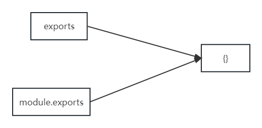
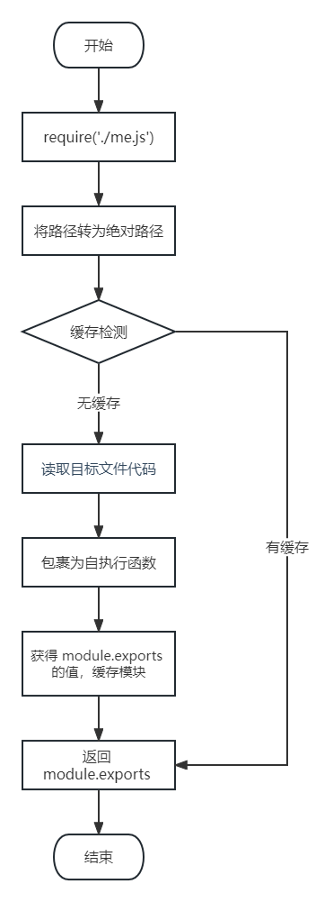

# 一、介绍

## 1、模块化与模块

将一个复杂的程序文件依据一定规则（规范）拆分成多个文件的过程称之为模块化

其中拆分出的 每个文件就是一个模块，模块的内部数据是私有的，不过模块可以暴露内部数据以便其他模块使用

## 2、模块化项目

编码时是按照模块一个一个编码的， 整个项目就是一个模块化的项目

## 3、模块化好处

下面是模块化的一些好处：

1.  防止命名冲突

2.  高复用性

3.  高维护性

# 二、模块暴露数据

## 1、模块初体验

可以通过下面的操作步骤，快速体验模块化

1.  创建 me.js


```js
//声明一个函数
function tiemo(){
  console.log('贴膜...');
}

//暴露数据
module.exports = tiemo;
```

2. 创建 index.js

```js
//导入模块
const tiemo = require('./me.js');

//调用函数
tiemo();
```

## 2、暴露数据

模块暴露数据的方式有两种：

1. module.exports = value
2. exports.name = value

> 使用时有几点注意：
>
> * module.exports 可以暴露 任意 数据
> * 不能使用 exports = value 的形式暴露数据，模块内部 module 与 exports 的隐式关系 exports = module.exports = {} ，require 返回的是目标模块中 module.exports 的值



```js
//声明一个函数
function tiemo(){
  console.log('贴膜...');
}

//捏脚
function niejiao(){
  console.log('捏脚....');
}

//暴露数据方式一
module.exports = {
  tiemo,
  niejiao
}

// 方式二：exports 暴露数据
// exports.niejiao = niejiao;
// exports.tiemo = tiemo;

//1. module.exports 可以暴露`任意`数据
// module.exports = 'iloveyou';
// module.exports = 521;

//2. 不能使用 `exports = value`的形式暴露数据
// exports = 'iloveyou' // X

// exports = module.exports = {}
// console.log(module.exports);
// console.log(module.exports === exports);

exports = module.exports = {tiemo:tiemo}
exports.tiemo = tiemo;
// exports = 'iloveyou' // error
```

# 三、导入（引入）模块

在模块中使用 require 传入文件路径即可引入文件

```js
const test = require('./me.js');
```

require 使用的一些注意事项：

1.  对于自己创建的模块，导入时路径建议写相对路径，且不能省略 ./ 和 ../。因为require中的相对路径不会受到工作目录的影响
    
2.  js 和 json 文件导入时可以不用写后缀，c/c++编写的 node 扩展文件也可以不写后缀，但是一般用不到。名字相同时，会先尝试导入 js 文件
    
3.  如果导入其他类型的文件，会以 js 文件进行处理
    
4.  如果导入的路径是个文件夹，则会 首先 检测该文件夹下 package.json 文件中 main 属性对应的文件，如果存在则导入，反之如果文件不存在会报错。如果 main 属性不存在，或者 package.json 不存在，则会尝试导入文件夹下的 index.js 和 index.json，如果还是没找到，就会报错

5.  导入 node.js 内置模块时，直接 require 模块的名字即可，无需加 ./ 和../

```js
//导入模块  // fs 
//const tiemo = require('./me.js');
//省略后缀 JS
const tiemo = require('./me');
// 调用函数
tiemo();

//导入 JSON 文件
// const duanzi = require('./duanzi.json');
const duanzi = require('./duanzi');
console.log(duanzi);//对象

//导入其他类型的文件
const test = require('./test');
console.log(test);
```

```js
//导入文件夹
const m = require('./module');
console.log(m);
```

# 四、导入模块的基本流程

这里我们介绍一下 require  导入 自定义模块 的基本流程

1.  将相对路径转为绝对路径，定位目标文件

2.  缓存检测

3.  读取目标文件代码

4.  包裹为一个函数并执行（自执行函数）。通过 arguments.callee.toString() 查看自执行函数
    
5.  缓存模块的值

6.  返回  module.exports 的值



代码实现：

```js
/**
 * 伪代码
 */

function require(file){
  //1. 将相对路径转为绝对路径，定位目标文件
  let absolutePath = path.resolve(__dirname, file);
  //2. 缓存检测
  if(caches[absolutePath]){
    return caches[absolutePath];
  }
  //3. 读取文件的代码
  let code = fs.readFileSync(absolutePath).toString();
  //4. 包裹为一个函数 然后执行
  let module = {};
  let exports = module.exports = {};
  (function (exports, require, module, __filename, __dirname) {
    const test = {
      name: '尚硅谷'
    }
  
    module.exports = test;
  
    //输出
    console.log(arguments.callee.toString());
  })(exports, require, module, __filename, __dirname)
  //5. 缓存结果
  caches[absolutePath] = module.exports;
  //6. 返回 module.exports 的值
  return module.exports;
}

const m = require('./me.js');
```

# 五、CommonJS 规范

module.exports、exports 以及 require 这些都是 模块化规范中的内容。

而 Node.js 是实现了 CommonJS 模块化规范，二者关系有点像 JavaScript 与 ECMAScript
