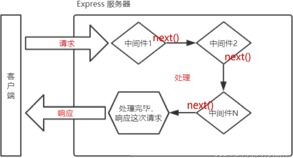

# 一、express 介绍

express 是一个基于 Node.js 平台的极简、灵活的 WEB 应用开发框架，官方网址：https://www.expressjs.com.cn/

简单来说，express 是一个封装好的工具包，封装了很多功能，便于我们开发 WEB 应用（HTTP 服务）

# 二、express 使用

## 1、express 下载

express 本身是一个 npm 包，所以可以通过 npm 安装

```sh
npm init
npm i express
```

## 2、express 初体验

大家可以按照这个步骤进行操作：

1.  创建 JS 文件，键入如下代码


```js
//1. 导入 express
const express = require('express');

//2. 创建应用对象
const app = express();

//3. 创建路由规则
app.get('/home', (req, res) => {
	res.end('hello express server');
});

//4. 监听端口 启动服务
app.listen(3000, () =>{
	console.log('服务已经启动, 端口监听为 3000...');
});
```

2. 命令行下执行该脚本

```sh
node <文件名>
# 或者
nodemon <文件名>
```

3. 然后在浏览器就可以访问 http://127.0.0.1:3000/home

# 三、express 路由

## 1、什么是路由

官方定义： 路由确定了应用程序如何响应客户端对特定端点的请求

## 2、路由的使用

一个路由的组成有 请求方法 ， 路径 和 回调函数 组成

express 中提供了一系列方法，可以很方便的使用路由，使用格式如下：

`app.(path，callback)`

代码示例：

```js
//导入 express
const express = require('express');

//创建应用对象
const app = express();

//创建get路由
app.get('/home', (req, res) => {
  res.end('hello express');
});

//首页路由
app.get('/', (req, res) => {
  console.log(req.ip);
  res.end('home');
});

//创建 post 路由
app.post('/login', (req, res) => {
  res.end('login login')
});

////匹配所有的请求方法
app.all('/test', (req, res) => {
  res.end('test test');
})

//自定义 404 响应
app.all('*', (req, res) => {
  res.end('404 not Found')
});

//监听端口, 启动服务
app.listen(3000, () => {
  console.log('服务已经启动, 端口 3000 正在监听中....')
})
```

## 3、获取请求参数

express 框架封装了一些 API 来方便获取请求报文中的数据，并且兼容原生 HTTP 模块的获取方式

```js
//导入 express
const express = require('express');

//创建应用对象
const app = express();

//创建路由
app.get('/request', (req, res) => {
  //原生操作
  console.log(req.method);
  console.log(req.url);
  console.log(req.httpVersion);
  console.log(req.headers);

  // express 操作
  console.log(req.path);
  // 获取 ip 
  console.log(req.ip);
  //express 独有的获取报文的方式
  //获取查询字符串
  console.log(req.query);
  //获取指定的请求头
  console.log(req.get('host'));

  res.end('hello express');
});

//监听端口, 启动服务
app.listen(3000, () => {
  console.log('服务已经启动, 端口 3000 正在监听中....')
})
```

## 4、获取路由参数

路由参数指的是 URL 路径中的参数（数据）

```js
//导入 express
const express = require('express');

//创建应用对象
const app = express();

//创建路由
app.get('/:id.html', (req, res) => {
  //获取 URL 路由参数
  console.log(req.params.id);
  res.setHeader('content-type','text/html;charset=utf-8');
  res.end('商品详情');
});


//监听端口, 启动服务
app.listen(3000, () => {
  console.log('服务已经启动, 端口 3000 正在监听中....')
})
```

练习：根据路由参数响应歌手的信息

路径结构如下：

```
/singer/1.html
```

显示歌手的姓名和图片

歌手的姓名和图片存放于一个 singers.json 文件中：

```json
{
  "singers": [
    {
      "singer_name": "周杰伦",
      "singer_pic": "http://y.gtimg.cn/music/photo_new/T001R150x150M0000025NhlN2yWrP4.webp",
      "other_name": "Jay Chou",
      "singer_id": 4558,
      "id": 1
    },
    {
      "singer_name": "林俊杰",
      "singer_pic": "http://y.gtimg.cn/music/photo_new/T001R150x150M000001BLpXF2DyJe2.webp",
      "other_name": "JJ Lin",
      "singer_id": 4286,
      "id": 2
    },
    ......
    {
      "singer_name": "Kirsty刘瑾睿",
      "singer_pic": "http://y.gtimg.cn/music/photo_new/T001R150x150M000002cJar62Es6zH.webp",
      "other_name": "",
      "singer_id": 3546632,
      "id": 80
    }
  ]
}
```

代码实现：

```js
//导入 express
const express = require('express');
//导入 json 文件
const {singers} = require('./singers.json');
//创建应用对象
const app = express();

//创建路由
app.get('/singer/:id.html', (req, res) => {
  //获取路由参数
  let {id} = req.params;
  //在数组中寻找对应 id 的数据
  let result = singers.find(item => {
    if(item.id === Number(id)){
      return true;
    }
  });

  //判断
  if(!result){
    res.statusCode = 404;
    res.end(`<h1>404 Not Found</h1>`)
    return;
  }

  res.end(`
  <!DOCTYPE html>
  <html lang="en">
  <head>
    <meta charset="UTF-8">
    <meta http-equiv="X-UA-Compatible" content="IE=edge">
    <meta name="viewport" content="width=device-width, initial-scale=1.0">
    <title>Document</title>
  </head>
  <body>
    <h2>${result.singer_name}</h2>
    
  </body>
  </html>`);
});

//监听端口, 启动服务
app.listen(3000, () => {
  console.log('服务已经启动, 端口 3000 正在监听中....')
})
```

# 四、express 响应设置

express 框架封装了一些 API 来方便给客户端响应数据，并且兼容原生 HTTP 模块的获取方式

一般响应设置：

```js
//导入 express
const express = require('express');

//创建应用对象
const app = express();

//获取请求的路由规则
app.get('/response', (req, res) => {
  //1. express 中设置响应的方式兼容 HTTP 模块的方式
  res.statusCode = 404;
  res.statusMessage = 'love';
  res.setHeader('xxx', 'yyy');
  res.write('hello express ')
  res.end('response');

  //2. express 的响应方法
  res.status(500);//设置响应状态码
  res.set('aaa','bbb');//设置响应头
  res.send('中文响应不乱码');//设置响应体
  //连贯操作
  res.status(500).set('abc','def').send('这都是 OK 的');
  
});

//监听端口, 启动服务
app.listen(3000, () => {
  console.log('服务已经启动, 端口 3000 正在监听中....')
})
```

其他响应设置：

```js
//导入 express
const express = require('express');

//创建应用对象
const app = express();

//创建路由
app.get('/other', (req, res) => {
  //跳转响应
  res.redirect('http://atguigu.com');
  //下载响应
  res.download(__dirname + '/package.json');
  // JSON 响应
  res.json({
     name: '尚硅谷',
     slogon: '让天下没有难学的技术'
  })
  //响应文件内容
  res.sendFile(__dirname + '/test.html');// path.resolve()
});

//监听端口, 启动服务
app.listen(3000, () => {
  console.log('服务已经启动, 端口 3000 正在监听中....')
})
```

# 五、express 中间件

## 1、什么是中间件

中间件（Middleware）本质是一个回调函数

中间件函数 可以像路由回调一样访问 请求对象（request）和响应对象（response）

## 2、中间件的作用

中间件的作用 就是使用函数封装公共操作，简化代码

## 3、中间件的类型

* 全局中间件
* 路由中间件

### 定义全局中间件

每一个请求 到达服务端之后都会执行全局中间件函数

声明中间件函数

```js
let recordMiddleware = function(request,response,next){
    //实现功能代码
    //.....
    //执行next函数(当如果希望执行完中间件函数之后，仍然继续执行路由中的回调函数，必须调用next)
	next();
}
```



应用中间件

```js
app.use(recordMiddleware);
```

声明时可以直接将匿名函数传递给 use：

```js
app.use(function (request, response, next) {
    console.log('定义第一个中间件');
    next();
})
```

完整代码示例：

```js
/**
 * 记录每个请求的 url 与 IP 地址
 */

//导入 express
const express = require('express');
const fs = require('fs');
const path = require('path');

//创建应用对象
const app = express();

//声明中间件函数
function recordMiddleware(req, res, next){
  //获取 url 和 ip
  let {url, ip} = req;
  //将信息保存在文件中 access.log
  fs.appendFileSync(path.resolve(__dirname, './access.log'), `${url}  ${ip}\r\n`);
  //调用 next
  next();
}

//使用中间件函数
app.use(recordMiddleware);

//创建路由
app.get('/home', (req, res) => {
  res.send('前台首页');
});

app.get('/admin', (req, res) => {
  res.send('后台首页');
});

app.all('*',(req, res) => {
  res.send('<h1>404 Not Found</h1>')
})

//监听端口, 启动服务
app.listen(3000, () => {
  console.log('服务已经启动, 端口 3000 正在监听中....')
})
```

### 多个全局中间件

express 允许使用 app.use() 定义多个全局中间件

```js
app.use(function (request, response, next) {
    console.log('定义第一个中间件');
    next();
    })
app.use(function (request, response, next) {
    console.log('定义第二个中间件');
    next();
})
```

### 定义路由中间件

如果 只需要对某一些路由进行功能封装 ，则就需要路由中间件

调用格式如下：

```js
app.get('/路径',`中间件函数`,(request,response)=>{

});
app.get('/路径',`中间件函数1`,`中间件函数2`,(request,response)=>{

});
```

代码示例：

```js
/**
 * 针对 /admin  /setting 的请求, 要求 URL 携带 code=521 参数, 如未携带提示『暗号错误』  
 */

//导入 express
const express = require('express');

//创建应用对象
const app = express();

//创建路由
app.get('/home', (req, res) => {
  res.send('前台首页');
});

//声明中间件
let checkCodeMiddleware = (req, res, next) => {
  //判断 URL 中是否 code 参数等于 521
  if(req.query.code === '521'){
    next();
  }else{
    res.send('暗号错误');
  }
}

//后台
app.get('/admin', checkCodeMiddleware, (req, res) => {
  res.send('后台首页');
});

//后台设置
app.get('/setting', checkCodeMiddleware, (req, res) => {
  res.send('设置页面');
});

app.all('*',(req, res) => {
  res.send('<h1>404 Not Found</h1>')
})

//监听端口, 启动服务
app.listen(3000, () => {
  console.log('服务已经启动, 端口 3000 正在监听中....')
})
```

## 4、静态资源中间件

express 内置处理静态资源的中间件

```js
//引入express框架
const express = require('express');
//创建服务对象
const app = express();
//静态资源中间件的设置，将当前文件夹下的public目录作为网站的根目录
app.use(express.static('./public')); //当然这个目录中都是一些静态资源
//如果访问的内容经常变化，还是需要设置路由
//但是，在这里有一个问题，如果public目录下有index.html文件，单独也有index.html的路由，
//则谁书写在前，优先执行谁
app.get('/index.html',(request,response)=>{
	respsonse.send('首页');
});
//监听端口
app.listen(3000,()=>{
	console.log('3000 端口启动....');
});
```

> 注意事项：
>
> 1. index.html 文件为默认打开的资源
> 2. 如果静态资源与路由规则同时匹配，谁先匹配谁就响应
> 3. 路由一般响应动态资源，静态资源中间件响应静态资源

静态资源中间件练习：实现局域网内可以访问尚品汇的网页

```js
//导入 express
const express = require('express');

//创建应用对象
const app = express();

//设置静态资源中间件
app.use(express.static(__dirname + '/尚品汇'));
//尚品汇文件夹下存放着尚品汇网页的实现代码

//监听端口, 启动服务
app.listen(3000, () => {
  console.log('服务已经启动, 端口 3000 正在监听中....')
})
```

## 5、获取请求体数据 body-parser

express 可以使用body-parser 包处理请求体

第一步：安装

```sh
npm i body-parser
```

第二步：导入 body-parser 包

```sh
const bodyParser = require('body-parser');
```

第三步：获取中间件函数

```js
//处理 querystring 格式的请求体
let urlParser = bodyParser.urlencoded({extended:false}));
//处理 JSON 格式的请求体
let jsonParser = bodyParser.json();
```

第四步：设置路由中间件，然后使用 request.body  来获取请求体数据

```js
app.post('/login', urlParser, (request,response)=>{
    //获取请求体数据
    //console.log(request.body);
    //用户名
    console.log(request.body.username);
    //密码
    console.log(request.body.userpass);
    response.send('获取请求体数据');
});
```

获取到的请求体数据：

```sh
[Object: null prototype] { username: 'admin', userpass: '123456' }
```

完整代码示例：

```js
/**
 * 按照要求搭建 HTTP 服务
 * GET   /login  显示表单网页
 * POST  /login  获取表单中的『用户名』和『密码』
 */
//导入 express
const express = require('express');
const bodyParser = require('body-parser')

//创建应用对象
const app = express();

//解析 JSON 格式的请求体的中间件
// const jsonParser = bodyParser.json()

//解析 querystring 格式请求体的中间件
const urlencodedParser = bodyParser.urlencoded({ extended: false })

//创建路由规则
app.get('/login', (req, res) => {
  // res.send('表单页面')
  //响应 HTML 文件内容
  res.sendFile(__dirname + '/11_form.html');
});

//post 规则
app.post('/login', urlencodedParser, (req, res) => {
  //获取 用户名 和 密码
  console.log(req.body);
  res.send('获取用户的数据')
});

//启动服务
app.listen(3000, () => {
  console.log('server is running...');
})
```

## 6、防盗链的实现

```js
//导入 express
const express = require('express');

//创建应用对象
const app = express();

//声明中间件
app.use((req, res, next) => {
  //检测请求头中的 referer 是否为 127.0.0.1
  //获取 referer
  let referer = req.get('referer');
  if(referer){
    //实例化
    let url = new URL(referer);
    //获取 hostname
    let hostname = url.hostname;
    //判断
    if(hostname !== '127.0.0.1'){
      //响应 404 
      res.status(404).send('<h1>404 Not Found</h1>');
      return;
    }
  }
  next();
});

//静态资源中间件设置
app.use(express.static(__dirname + '/public'));

//监听端口, 启动服务
app.listen(3000, () => {
  console.log('服务已经启动, 端口 3000 正在监听中....')
})
```

# 六、Router

## 1、什么是 Router

express 中的 Router 是一个完整的中间件和路由系统，可以看做是一个小型的 app 对象。

## 2、Router 作用

对路由进行模块化，更好的管理路由

## 3、Router 使用

创建独立的 JS 文件（homeRouter.js）

```js
//1. 导入 express
const express = require('express');

//2. 创建路由器对象
const router = express.Router();

//3. 在 router 对象身上添加路由,创建路由规则
router.get('/', (req, res) => {
	res.send('首页');
})
router.get('/cart', (req, res) => {
	res.send('购物车');
});

//4. 暴露
module.exports = router;
```

创建独立的 JS 文件（adminRouter.js）

```js
//1. 导入 express
const express = require('express');

//2. 创建路由对象
const router = express.Router();

// router.use()

//后台
router.get('/admin', (req, res) => {
  res.send('后台首页');
});

//后台设置
router.get('/setting', (req, res) => {
  res.send('设置页面');
});

module.exports = router;
```

主文件

```js
//导入 express
const express = require('express');
//引入子路由文件
const homeRouter = require('./routes/homeRouter');
const adminRouter = require('./routes/adminRouter');

//创建应用对象
const app = express();

//设置和使用中间件
app.use(homeRouter);
app.use(adminRouter);

app.all('*',(req, res) => {
  res.send('<h1>404 Not Found</h1>')
})

//监听端口, 启动服务
app.listen(3000, () => {
  console.log('服务已经启动, 端口 3000 正在监听中....')
})
```

# 七、EJS 模板引擎

## 1、什么是模板引擎

模板引擎是分离 用户界面和业务数据 的一种技术

## 2、什么是 EJS

EJS 是一个高效的 Javascript 的模板引擎

官网：https://ejs.co/

中文站：https://ejs.bootcss.com/

## 3、EJS 初体验

下载安装EJS

```sh
npm i ejs --save
```

代码示例

```js
//1. 安装 EJS
//2. 导入 EJS
const ejs = require('ejs');
const fs = require('fs');

//字符串
let china = '中国';
// let str = `我爱你 ${china}`;
let weather = '今天天气不错~';

//声明变量
let str = fs.readFileSync('./01_html.html').toString();

//使用 ejs 渲染
//ejs解析模板返回结构
//<%= %> 是ejs解析内容的标记，作用是输出当前表达式的执行结构
let result = ejs.render(str, {china: china, weather});

console.log(result);
```

```html
<!DOCTYPE html>
<html lang="en">
<head>
  <meta charset="UTF-8">
  <meta http-equiv="X-UA-Compatible" content="IE=edge">
  <meta name="viewport" content="width=device-width, initial-scale=1.0">
  <title>Document</title>
</head>
<body>
  <h2>我爱你 <%= china %></h2>
  <p><%= weather %></p>
</body>
</html>
```

## 4、EJS 常用语法

执行JS代码

`<% code %>`

输出转义的数据到模板上

`<%= code %>`

输出非转义的数据到模板上

`<%- code %>`

## 5、EJS列表渲染

```js
const ejs = require('ejs');
//西游记
const xiyou = ['唐僧','孙悟空','猪八戒','沙僧'];

//原生 JS
// let str = '<ul>';

// xiyou.forEach(item => {
//   str += `<li>${item}</li>`;
// })

// //闭合 ul
// str += '</ul>';
// console.log(str);

// EJS 实现
const fs = require('fs');
let html = fs.readFileSync('./02_西游.html').toString();
let result = ejs.render(html, {xiyou:xiyou});

console.log(result);
```

```html
<!DOCTYPE html>
<html lang="en">
<head>
  <meta charset="UTF-8">
  <meta http-equiv="X-UA-Compatible" content="IE=edge">
  <meta name="viewport" content="width=device-width, initial-scale=1.0">
  <title>西游四人组</title>
</head>
<body>
  <h2>西游四人组</h2>
  <ul>
    <% xiyou.forEach(item => { %>
    <li><%= item %></li>
    <% }) %>
  </ul>
</body>
</html>
```

## 6、EJS条件渲染

```js
/**
 * 通过 isLogin 决定最终的输出内容
 * true   输出『<span>欢迎回来</span>』
 * false  输出『<button>登录</button>  <button>注册</button>』
 */
// 导入 ejs
const ejs = require('ejs');
const fs = require('fs');
//变量
let isLogin = true;

//原生 JS
// if(isLogin){
//   console.log('<span>欢迎回来</span>')
// }else{
//   console.log('<button>登录</button>  <button>注册</button>');
// }

//EJS 实现
//读取 HTML 内容
let html = fs.readFileSync('./03_home.html').toString();
let result = ejs.render(html, {isLogin: isLogin});

console.log(result);
```

```html
<!DOCTYPE html>
<html lang="en">
<head>
  <meta charset="UTF-8">
  <meta http-equiv="X-UA-Compatible" content="IE=edge">
  <meta name="viewport" content="width=device-width, initial-scale=1.0">
  <title>Document</title>
</head>
<body>
  <header>
    <% if(isLogin){ %>
    <span>欢迎回来</span>
    <% }else{ %>
    <button>登录</button>  <button>注册</button>
    <% } %>
  </header>
</body>
</html>
```

## 7、express中使用ejs

```js
//导入 express
const express = require('express');
//导入 path
const path = require('path');
//创建应用对象
const app = express();
//1. 设置express使用的模板引擎为ejs
app.set('view engine', 'ejs');// 其他模板引擎如pug、twing
//2. 设置模板文件存放位置
//模板文件: 具有模板语法内容的文件
app.set('views', path.resolve(__dirname, './views'));

//创建路由
app.get('/home', (req, res) => {
  //3. render 响应
  // res.render('模板的文件名', '数据');
  //声明变量
  let title = '尚硅谷 - 让天下没有难学的技术';
  res.render('home', {title});
  //4. 到views对应的文件夹中创建模板文件
});

//监听端口, 启动服务
app.listen(3000, () => {
  console.log('服务已经启动, 端口 3000 正在监听中....')
})
```

```html
<!DOCTYPE html>
<html lang="en">
<head>
  <meta charset="UTF-8">
  <meta http-equiv="X-UA-Compatible" content="IE=edge">
  <meta name="viewport" content="width=device-width, initial-scale=1.0">
  <title>Document</title>
</head>
<body>
  <h2><%= title %></h2>
</body>
</html>
```

# 八、应用程序生成器

express-generator工具参考链接：[Express 应用程序生成器 - Express 中文文档 | Express 中文网 (expressjs.com.cn)](https://www.expressjs.com.cn/starter/generator.html)

# 九、文件上传

文件上传也是在发送http请求报文

处理文件上传的请求需要安装formidable包，参考链接：[formidable - npm (npmjs.com)](https://www.npmjs.com/package/formidable)

```js
var express = require('express');
var router = express.Router();
//导入
const formidable = require('formidable');

/* GET home page. */
router.get('/', function(req, res, next) {
  res.render('index', { title: 'Express' });
});

//显示网页的 (表单)
router.get('/portrait', (req, res) => {
  res.render('portrait');
});

//处理文件上传
router.post('/portrait', (req, res) => {
  //创建 form 对象
  const form = formidable({ 
    multiples: true ,
    //设置上传文件的保存目录
    uploadDir: __dirname + '/../public/images',
    //保持文件后缀
    keepExtensions: true
  });
  //解析请求报文
  form.parse(req, (err, fields, files) => {
    if (err) {
      next(err);
      return;
    }
    // console.log(fields);// fields只存一般字段，即除了文件上传之外的字段，如text，radio，checkbox  select
    // console.log(files); // file类型的数据都会保存在files中
    
    //服务器保存该图片的访问 URL
    // /images/8ad3d5e36012212ba7642c000.jpg
    let url = '/images/' + files.portrait.newFilename;//将来将此数据保存在数据库中
    
    res.send(url);
  });
});

module.exports = router;
```

```ejs
<!DOCTYPE html>
<html lang="en">
<head> 
  <meta charset="UTF-8">
  <meta http-equiv="X-UA-Compatible" content="IE=edge">
  <meta name="viewport" content="width=device-width, initial-scale=1.0">
  <title>文件上传</title>
</head>
<body>
  <h2>文件上传</h2>
  <hr>
  <!-- enctype：文件上传的必需的属性 -->
  <form action="/portrait" method="post" enctype="multipart/form-data">
    用户名: <input type="text" name="username"><br>
    头像: <input type="file" name="portrait"><br>
    <hr>
    <button>点击提交</button>
  </form>
</body>
</html>
```

